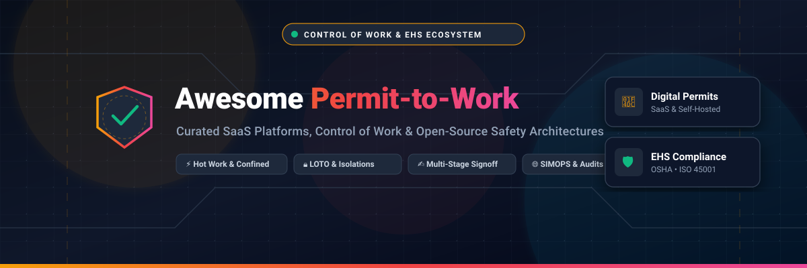

<p align="center">
  
</p>

<h1 align="center">🛡️ Awesome Permit-to-Work Platform ⚡</h1>

<div align="center">

<a href="https://github.com/ishandutta2007/Awesome-Awesome-Awesome"></a>
<a href="https://discord.gg/jc4xtF58Ve"></a>
<a href="https://github.com/ishandutta2007/Awesome-Permit-To-Work-Platform/stargazers"></a>
<a href="https://github.com/ishandutta2007/Awesome-Permit-To-Work-Platform/network/members"></a>
<a href="https://github.com/ishandutta2007/Awesome-Permit-To-Work-Platform/blob/main/LICENSE"></a>
<a href="https://github.com/ishandutta2007/Awesome-Permit-To-Work-Platform/pulls"></a>
<a href="https://github.com/ishandutta2007"></a>

</div>

<p align="center">
  <strong>Curated ecosystem of SaaS Platforms, Control of Work (CoW) systems, High-Risk Activity Authorizations, Safety Workflows, Lockout/Tagout (LOTO) &amp; Open-Source EHS Software Architectures.</strong>
</p>

---

## 📌 Table of Contents

- [🌟 Overview &amp; Key Concepts](#-overview--key-concepts)
- [🏢 SaaS &amp; Commercial Hosted Platforms](#-saas--commercial-hosted-platforms)
- [💻 Open-Source GitHub Projects](#-open-source-github-projects)
- [🏗️ Self-Hosted Architecture Blueprint](#️-self-hosted-architecture-blueprint)
- [🤝 How to Contribute](#-how-to-contribute)
- [📈 Star History](#-star-history)
- [⚠️ Disclaimer](#️-disclaimer)

---

## 🌟 Overview & Key Concepts

**Permit-to-Work (PTW)** and **Control of Work (CoW)** platforms form the mission-critical backbone of operational safety across high-hazard industries, including oil & gas, chemicals, mining, utilities, heavy manufacturing, construction, and offshore installations.

These systems digitize, automate, and strictly govern hazardous activity authorizations:
- 🔥 **Hot Work & Welding**: Atmospheric monitoring, fire watch sign-offs, thermal isolation.
- 🕳️ **Confined Space Entry**: Gas testing logs, ventilation checks, continuous safety attendant logs.
- ⚡ **Lockout / Tagout (LOTO)**: Mechanical, electrical, hydraulic, and pneumatic isolation certificates.
- 🏗️ **Lifting Operations & Work at Height**: Critical lift plans, harness checks, wind speed limits.
- 🌐 **SIMOPS (Simultaneous Operations)**: Real-time geospatial and operational conflict detection.
- ✍️ **Multi-Stage Approvals**: Competency verification, digital signatures, issuer/acceptor handovers, suspension, and safe closure.

---

## 🏢 SaaS & Commercial Hosted Platforms

> 📊 **Market Insights & Industry Dynamics:** The global Permit-to-Work (PTW), Control of Work (CoW), and digital EHS software market is estimated at **$7.5B – $9.2B USD** (projected to reach $14B+ by 2030 at a CAGR of ~11.8%). The sector is currently **moderately fragmented**, undergoing strategic consolidation as global enterprise EHS/ESG suites (e.g., Wolters Kluwer Enablon, Blackstone Sphera, Fortive Intelex) acquire specialized, high-risk industrial safety, mobile inspection, and permit compliance solutions.

| Platform / Vendor | Focus & Key Capabilities | Company Size / Valuation / Revenue | Starting Tier Pricing | Free Tier / Trial Limits |
| :--- | :--- | :--- | :--- | :--- |
| [**Enablon**](https://enablon.com) | Enterprise EHS, sustainability, operational risk governance, and complex multi-facility Control of Work. | **~$6.2B Parent Rev** *(Wolters Kluwer / ~$180M+ Enablon ARR)* | **~$1,000 / month** *(~$12,000/year base deployment; ~$100/user/mo)* | **30-day assisted POC trial** & enterprise sandbox environment upon sales qualification |
| [**SafetyCulture**](https://safetyculture.com) | Mobile-first operations platform for dynamic risk assessments, digital checklists, and permit workflows. | **~$1.8B Valuation** *(~$150M+ ARR)* | **$24 / user / month** *(billed annually; $29/user/mo billed monthly)* | **Free forever tier** (up to 10 users & 5 active inspection templates); **30-day full Premium trial** |
| [**Sphera**](https://sphera.com) | Integrated operational risk management, process safety, hazardous barrier governance, and CoW. | **~$1.4B Valuation** *(Acquired by Blackstone / ~$220M+ Rev)* | **~$833 / month** *(~$10,000/year base package; ~$80/user/mo)* | **30-day proof-of-concept (POC)** sandbox environment available upon qualified request |
| [**Ideagen**](https://www.ideagen.com) *(inc. Beakon & Airsweb)* | Enterprise governance, risk, compliance, QHSE workflows, and field safety permit management. | **~$1.3B Valuation** *(Acquired by HG Capital / £80M+ ($105M) Rev)* | **~$416 / month** *(~$5,000/year base tier; ~$45/user/mo)* | **30-day free trial** with pre-loaded audit/permit templates and live reporting dashboards |
| [**Cority**](https://www.cority.com) | Enterprise EHS SaaS platform providing electronic PTW, mobile field approvals, and real-time permit conflict monitoring. | **~$1.0B+ Valuation** *(Thoma Bravo backed / ~$120M Rev)* | **~$667 / month** *(~$8,000/year starting contract; ~$70/user/mo)* | **30-day interactive demo sandbox** and structured pilot program on request |
| [**Intelex**](https://www.intelex.com) | Configurable enterprise EHSQ software platform supporting automated permit workflows and site compliance at scale. | **~$6.0B Parent Rev** *(Fortive Corp / ~$110M Intelex ARR)* | **~$500 / month** *(~$6,000/year base tier; ~$60/user/mo)* | **Guided trial sandbox** with pre-configured industrial safety datasets (qualification required) |
| [**VelocityEHS**](https://www.ehs.com) | Cloud EHS platform covering operational safety, chemical safety, industrial hygiene, and permit workflows. | **~$100M+ ARR** | **~$416 / month** *(~$5,000/year annual tier; ~$50/user/mo)* | **14-day guided trial access** for qualified industrial safety teams |
| [**EcoOnline**](https://www.ecoonline.com) | Chemical safety, operational risk management, contractor tracking, and digital Permit-to-Work modules. | **~$400M Valuation** *(Acquired by Apax Partners / ~$90M ARR)* | **$50 / user / month** *(~$3,600/year minimum commitment)* | **14-day assisted pilot sandbox** & interactive on-demand tour (no self-serve free tier) |
| [**Benchmark Gensuite**](https://www.benchmarkgensuite.com) | Configurable digital PTW workflows, customizable hazard forms, contractor sign-offs, and SIMOPS awareness. | **~$65M+ Revenue** | **~$400 / month** *(~$4,800/year base tier; ~$40/user/mo)* | **30-day customized digital sandbox** & guided interactive trial environment |
| [**HSI Donesafe**](https://donesafe.com) | Modular safety management platform connecting workers with digital safety forms, permits, and audits. | **~$45M+ Revenue** *(Part of HSI)* | **$35 / user / month** *(or $3,600/year base SME plan)* | **14-day free trial** with full access to safety modules, no credit card required |
| [**Quentic**](https://www.quentic.com) | European EHS and ESG platform supporting occupational health, environmental compliance, and work authorization. | **~$40M+ Revenue** *(Acquired by AMCS Group)* | **~$333 / month** *(~$4,000/year base license; ~$40/user/mo)* | **14-day guided sandbox access** with pre-configured legal and safety registers |
| [**IsoMetrix**](https://www.isometrix.com) | Integrated risk and EHS management software designed for mining, metals, and heavy high-risk industries. | **~$35M+ Revenue** | **~$500 / month** *(~$6,000/year starting package; ~$50/user/mo)* | **30-day structured proof-of-concept (POC)** sandbox for enterprise evaluations |
| [**Evotix**](https://www.evotix.com) | Intuitive workforce health, safety, and operational risk management solution with mobile incident and permit capture. | **~$30M+ Revenue** *(Formerly SHE Software)* | **~$290 / month** *(~$3,500/year base tier; ~$35/user/mo)* | **14-day guided trial sandbox** available upon request |
| [**Novade**](https://www.novade.net) | Field management and construction site safety platform supporting mobile permit requests and subcontractor checks. | **~$15M+ Valuation** | **$39 / user / month** *($29/user/mo billed annually; Standard tier)* | **Free forever tier** (up to 5 users & 5 projects); **7-day free trial** for Standard & Premium plans |
| [**Pro-Sapien**](https://www.pro-sapien.com) | Enterprise EHS software natively integrated into Microsoft 365, SharePoint, and Teams for seamless enterprise signoffs. | **~$10M+ Revenue** | **~$500 / month** *(~$6,000/year for Microsoft 365/SharePoint integration)* | **30-day interactive Microsoft 365 pilot** and demo tenant deployment |
| [**Tekmon**](https://www.tekmon.com) | Mobile-first workflow and digital permit automation platform for distributed field and plant operations. | **~$5M+ Valuation** | **$35 / user / month** | **14-day free trial** with pre-configured permit templates, no credit card required |
| [**Safetymint**](https://www.safetymint.com) | Cloud safety management software featuring digital permit-to-work, incident reporting, and HIRA tools. | **~$3M+ Revenue** | **$3,600 / year** *(includes 5 user licenses; $35/additional user/mo)* | **14-day free trial** with unlimited module access, no credit card required |
| [**SmartQHSE**](https://www.smartqhse.com) | AI-powered HSE copilot and digital Permit-to-Work system with multi-stage digital signatures. | **~$2M+ Valuation** | **$19 / user / month** *(Starter tier) or $59/user/mo (Plus tier)* | **Free forever ARIA tier** (1 user, 1 project, 512 MB storage); **14-day free trial** on paid tiers |

---

## 💻 Open-Source GitHub Projects

The open-source ecosystem provides building blocks, low-code engines, BPMN workflow runners, electronic signatures, and purpose-built safety platforms to architect sovereign, customizable, and auditable Permit-to-Work solutions.

*Sorted descending by GitHub_Stars:*

| Repository &amp; Stargazers Badge | Primary Category | Description &amp; PTW Use Case |
| :--- | :--- | :--- |
| [**Elasticsearch**](https://github.com/elastic/elasticsearch) [](https://github.com/elastic/elasticsearch/stargazers) | 🔍 Search &amp; Analytics | Distributed search engine for querying historical work permits, gas readings, and incident logs. |
| [**n8n**](https://github.com/n8n-io/n8n) [](https://github.com/n8n-io/n8n/stargazers) | ⚡ Workflow Automation | Fair-code workflow automation for orchestrating permit notifications, escalations, and messaging. |
| [**NocoDB**](https://github.com/nocodb/nocodb) [](https://github.com/nocodb/nocodb/stargazers) | 🗄️ No-Code Database | Smart spreadsheet-database interface for managing permit registers, certificates, and safety logs. |
| [**Odoo Community**](https://github.com/odoo/odoo) [](https://github.com/odoo/odoo/stargazers) | 🏢 Business Suite / ERP | Extensible ERP suite customizable with maintenance work orders and hazardous permit approvals. |
| [**Apache Airflow**](https://github.com/apache/airflow) [](https://github.com/apache/airflow/stargazers) | ⏱️ Orchestration | Scheduled data pipelines for compliance audits, scheduled permit expirations, and safety reporting. |
| [**Appsmith**](https://github.com/appsmithorg/appsmith) [](https://github.com/appsmithorg/appsmith/stargazers) | 🖥️ Low-Code Admin Panel | Low-code framework for building custom permit creation dashboards, reviewer portals, and monitors. |
| [**Plane**](https://github.com/makeplane/plane) [](https://github.com/makeplane/plane/stargazers) | 📋 Project Management | Modern open-source tracking engine for corrective actions (CAPA) and permit verification milestones. |
| [**ToolJet**](https://github.com/ToolJet/ToolJet) [](https://github.com/ToolJet/ToolJet/stargazers) | 🖥️ Low-Code Builder | Rapid internal tool builder for connecting databases and APIs into custom PTW issuance consoles. |
| [**Directus**](https://github.com/directus/directus) [](https://github.com/directus/directus/stargazers) | 🌐 Headless Data Platform | Headless CMS and real-time REST/GraphQL API layer over SQL databases for managing permit records. |
| [**Nextcloud**](https://github.com/nextcloud/server) [](https://github.com/nextcloud/server/stargazers) | 📁 Secure Storage | Self-hosted collaboration cloud for storing safety procedures, JSA attachments, and signed permits. |
| [**Paperless-ngx**](https://github.com/paperless-ngx/paperless-ngx) [](https://github.com/paperless-ngx/paperless-ngx/stargazers) | 📄 Document Management | OCR-enabled document management system for archiving, tagging, and indexing scanned safety permits. |
| [**Budibase**](https://github.com/Budibase/budibase) [](https://github.com/Budibase/budibase/stargazers) | 🖥️ Low-Code Platform | Low-code platform tailored for internal business apps, role-based approval queues, and PTW forms. |
| [**Keycloak**](https://github.com/keycloak/keycloak) [](https://github.com/keycloak/keycloak/stargazers) | 🔑 Identity &amp; Access | Open-source IAM and SSO for enforcing role-based permissions on permit issuers, acceptors, and auditors. |
| [**ERPNext**](https://github.com/frappe/erpnext) [](https://github.com/frappe/erpnext/stargazers) | 🏢 Integrated ERP | Comprehensive ERP platform with asset management, maintenance jobs, and safety workflows. |
| [**Node-RED**](https://github.com/node-red/node-red) [](https://github.com/node-red/node-red/stargazers) | 📡 IoT &amp; Hardware Flows | Visual flow editor for integrating industrial gas sensors, beacon location tags, and emergency trip alarms. |
| [**Authentik**](https://github.com/goauthentik/authentik) [](https://github.com/goauthentik/authentik/stargazers) | 🔑 Identity Provider | Modern identity provider supporting MFA, SAML, and OAuth2 for field technician authentication. |
| [**NocoBase**](https://github.com/nocobase/nocobase) [](https://github.com/nocobase/nocobase/stargazers) | 🧩 Extensible No-Code | Scalable no-code architecture suitable for custom permit workflows, sub-tables, and permission models. |
| [**Activepieces**](https://github.com/activepieces/activepieces) [](https://github.com/activepieces/activepieces/stargazers) | ⚡ Open Automation | No-code workflow automation tool for triggering SMS/Email alerts on permit suspension or breach. |
| [**Temporal**](https://github.com/temporalio/temporal) [](https://github.com/temporalio/temporal/stargazers) | 🔄 Durable Workflow Engine | Fault-tolerant workflow orchestrator for long-running permits, shift handovers, and isolation states. |
| [**Documenso**](https://github.com/documenso/documenso) [](https://github.com/documenso/documenso/stargazers) | ✍️ Digital Signatures | Modern digital signing infrastructure for cryptographic verification of permit authorizations. |
| [**Baserow**](https://github.com/bram2w/baserow) [](https://github.com/bram2w/baserow/stargazers) | 🗄️ Database &amp; Airtable Alt | Relational database tool with real-time collaboration for tracking active permits and risk matrices. |
| [**OpenSearch**](https://github.com/opensearch-project/OpenSearch) [](https://github.com/opensearch-project/OpenSearch/stargazers) | 🔍 Analytics &amp; Search | Community-driven search suite for querying millions of historical safety logs and compliance records. |
| [**OpenProject**](https://github.com/opf/openproject) [](https://github.com/opf/openproject/stargazers) | 📊 Project Coordination | Open-source project tool for managing turnaround (TAR) maintenance permits and safety dependencies. |
| [**Open Policy Agent (OPA)**](https://github.com/open-policy-agent/opa) [](https://github.com/open-policy-agent/opa/stargazers) | 🛡️ Authorization &amp; Policy | General-purpose policy engine for enforcing deterministic permit authorization rules (e.g. SIMOPS rules). |
| [**Frappe Framework**](https://github.com/frappe/frappe) [](https://github.com/frappe/frappe/stargazers) | 🐍 Python Web Framework | Full-stack meta-framework with built-in DocTypes, workflows, and RBAC to build custom PTW apps. |
| [**Flowable**](https://github.com/flowable/flowable-engine) [](https://github.com/flowable/flowable-engine/stargazers) | ⚙️ BPMN / CMMN Engine | Compact BPMN 2.0 and CMMN workflow engine executing multi-stage safety review and approval trees. |
| [**Camunda BPM**](https://github.com/camunda/camunda-bpm-platform) [](https://github.com/camunda/camunda-bpm-platform/stargazers) | ⚙️ Process Automation | Enterprise-grade workflow and decision engine for modeling complex industrial authorization lifecycles. |
| [**Taiga**](https://github.com/taigaio/taiga-back) [](https://github.com/taigaio/taiga-back/stargazers) | 📋 Agile Task Tracker | Clean project management system for tracking safety non-conformances and permit audit findings. |
| [**OpenSign**](https://github.com/OpenSign-Labs/OpenSign) [](https://github.com/OpenSign-Labs/OpenSign/stargazers) | ✍️ Electronic Signature | Free and open-source electronic signature platform alternative to DocuSign for permit signoffs. |
| [**OpenTelemetry**](https://github.com/open-telemetry/opentelemetry-specification) [](https://github.com/open-telemetry/opentelemetry-specification/stargazers) | 🔭 Observability | Telemetry standards for tracing and monitoring distributed safety-critical permit microservices. |
| [**Mayan EDMS**](https://github.com/mayan-edms/mayan-edms) [](https://github.com/mayan-edms/mayan-edms/stargazers) | 🗃️ Electronic Document System | Document management system with cryptographic signatures, staging, and audit retention policies. |
| [**LimeSurvey**](https://github.com/LimeSurvey/LimeSurvey) [](https://github.com/LimeSurvey/LimeSurvey/stargazers) | 📝 Questionnaires &amp; Forms | Dynamic survey engine suitable for pre-job safety checklists and worker competency quizzes. |
| [**Form.io**](https://github.com/formio/formio) [](https://github.com/formio/formio/stargazers) | 📝 Dynamic Form Builder | Form builder and runtime engine for crafting conditional, JSON-driven hazardous work permit templates. |
| [**OhMyForm**](https://github.com/ohmyform/ohmyform) [](https://github.com/ohmyform/ohmyform/stargazers) | 📝 Lightweight Forms | Open-source alternative to Typeform for streamlined mobile hazard reporting and inspection forms. |
| [**jBPM**](https://github.com/kiegroup/jbpm) [](https://github.com/kiegroup/jbpm/stargazers) | ⚙️ Business Logic &amp; BPMN | Java-based business process automation and rules engine for industrial safety procedures. |
| [**ProcessMaker**](https://github.com/ProcessMaker/processmaker) [](https://github.com/ProcessMaker/processmaker/stargazers) | ⚙️ Workflow Management | Open workflow management tool for modeling multi-tier permit approvals and contractor reviews. |
| [**Docassemble**](https://github.com/jhpyle/docassemble) [](https://github.com/jhpyle/docassemble/stargazers) | 📄 Document Automation | Guided interview and document generation engine for building regulatory compliance paperwork. |
| [**OpenForms**](https://github.com/open-formulieren/open-forms) [](https://github.com/open-formulieren/open-forms/stargazers) | 📝 Enterprise Form Server | Form platform supporting strict data schemas and public/internal permit applications. |
| [**AEGIS PT**](https://github.com/ishandutta2007/aegis-pt) [](https://github.com/ishandutta2007/aegis-pt/stargazers) | ⚓ Dedicated PTW System | Dedicated open-source permit system engineered for offshore operations, hot work, and electrical interventions. |
| [**BeaconHS**](https://github.com/ishandutta2007/beacon-hs) [](https://github.com/ishandutta2007/beacon-hs/stargazers) | 🏗️ Construction HSE Suite | Open EHS platform for industrial construction with digital permits, JSAs, and corrective actions. |
| [**Autonomous EHS Management**](https://github.com/ishandutta2007/autonomous-ehs-management) [](https://github.com/ishandutta2007/autonomous-ehs-management/stargazers) | 🛡️ Integrated EHS Platform | Self-hosted platform covering work permits, incident management, CAPA, audits, and metrics. |
| [**Awesome HSE**](https://github.com/ishandutta2007/awesome-hse) [](https://github.com/ishandutta2007/awesome-hse/stargazers) | 📚 Curated Directory | Curated repository and resource directory for safety engineering and digital EHS tools. |
| [**HSE Calculators**](https://github.com/ishandutta2007/hse-calculators) [](https://github.com/ishandutta2007/hse-calculators/stargazers) | 🧮 Safety Math Engine | TypeScript library for quantitative risk metrics, heat stress, noise exposure, and lift calculations. |

---

## 🏗️ Self-Hosted Architecture Blueprint

A robust, enterprise-grade, self-hosted Permit-to-Work system can be constructed by combining battle-tested open-source components:

```text
┌────────────────────────────────────────────────────────────────────────┐
│                        USER INTERFACE & MOBILE FIELD                   │
│   • Appsmith / Budibase / Custom Web UI (Permit Requests & Issuance)    │
│   • Form.io / OpenForms (Dynamic Hazardous Forms & JSAs)               │
└───────────────────────────────────┬────────────────────────────────────┘
                                    │
                                    ▼
┌────────────────────────────────────────────────────────────────────────┐
│                      CORE WORKFLOW & LOGIC ENGINE                      │
│   • Flowable / Camunda / Temporal (Multi-Stage Approval State Machines)│
│   • Open Policy Agent (Deterministic Conflict & SIMOPS Policy Checks)  │
└───────────────────┬───────────────────────────────┬────────────────────┘
                    │                               │
                    ▼                               ▼
┌──────────────────────────────────────┐ ┌───────────────────────────────┐
│     SECURITY, IDENTITY & SIGNING     │ │       DATA & SENSOR IOT       │
│ • Keycloak / Authentik (IAM / SSO)   │ │ • PostgreSQL (Permit State)   │
│ • Documenso / OpenSign (Signatures)  │ │ • Node-RED (Gas/IoT Alarms)   │
│ • Paperless-ngx (Permanent Archives) │ │ • OpenSearch (Audit Analytics)│
└──────────────────────────────────────┘ └───────────────────────────────┘
```

### 🔁 The Standard Permit Lifecycle

```text
[1. Request Permit] ➔ [2. Hazard ID / JSA] ➔ [3. Lockout/Tagout Isolation] ➔ [4. Competency Check]
                                                                                     │
[8. Audit Archive] ◄─ [7. Safe Closure] ◄─ [6. Active Monitoring] ◄─ [5. Issuer Signoff]
```

---

## 🤝 How to Contribute

We welcome community contributions! To suggest a new tool, correct pricing/limits, or improve architectural patterns:

1. 🍴 **Fork the repository**.
2. 🌿 **Create a new branch**: `git checkout -b feature/add-new-ptw-tool`.
3. ✍️ **Add or edit entries in `README.md`** (follow existing table structure with factual pricing and star badges).
4. 🚀 **Submit a Pull Request** with a concise description of your changes.
5. ⭐ **Star the repository** if you find it valuable!

---

## 📈 Star History

[](https://star-history.dera.page/#ishandutta2007/Awesome-Permit-To-Work-Platform&type=date&legend=top-left)

---

## ⚠️ Disclaimer

- This is a community-curated directory intended for technical research and architectural reference; it does not constitute an endorsement.
- **Permit-to-Work systems are safety-critical operational controls.** Software must never replace qualified human oversight, certified site procedures, physical lockout practices, or statutory regulatory standards (e.g., OSHA 1910, UK HSE, ISO 45001).
- AI systems and automated tools must never autonomously approve, release, or energize hazardous work permits without accountable human verification.

---

<p align="center">
  <sub>Maintained with ❤️ for safety engineers, EHS managers, plant operators, and software architects worldwide.</sub>
</p>
